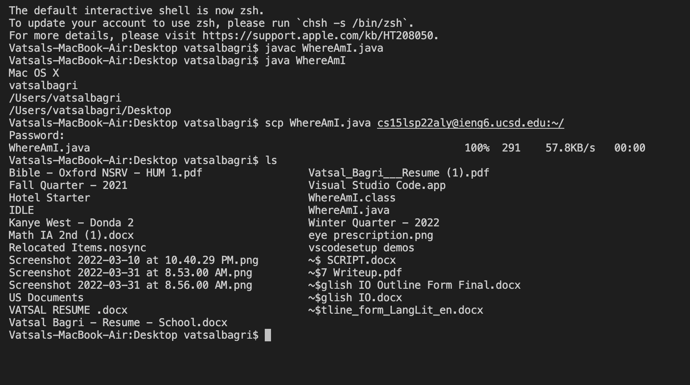

# Lab Report for Week 1

The first step for Week 1's lab project was to install VS Code. I already had VS code installed however for someone that wants to do it they can do it [here](https://code.visualstudio.com/). Once the VS code tab is open, it looks like:-

After this step, we learnt how to remotely connect to the server from our local device.
We can do so by using the **ssh** command followed by the course specific username. By following the steps after that i.e., answering the questions, the final outcome once connected looks like this:-
.

Upon completion, we tried out some commands to familiarize ourselves with these lab skills. The commands included:- 

* cd
* ls
* ls -lat
* ls -a
* ls </home/linux/ieng6/cs15lsp22/cs15lsp22_username_> 
* cp /home/linux/ieng6/cs15lsp22/public/hello.txt ~/
* cat /home/linux/ieng6/cs15lsp22/public/hello.txt

The result of all these commands looks like:-

Post the commands, we moved files with the **scp** command. Post writing a file called WhereAmI.java to keep track of our files location, we ran more commands to navigate through the computer and keep track of our files. Since we can keep track of the files, the effect of the command **scp WhereAmI.java cs15lsp22zz@ieng6.ucsd.edu:~/** is quite clear. The process is shown in the screenshot below:- 

Normally, everytime one logs in, they have to enter the password which can be a hassle which is why through the ssh-keys command, we use the public and private key which further uses the ssh commands in place of the password boosting efficiency in the work environment. The process looks like:-

Lastly, to further smoothen the experience, one can combine commands and use the steps that we mentioned above.
Combining commands can look like:- 

**$ cp WhereAmI.java OtherMain.java; javac OtherMain.java; java WhereAmI**