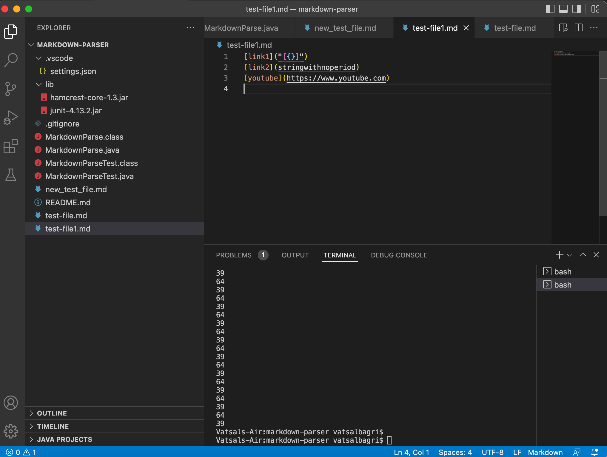

# Lab Report 2 - Week 4

## Failure inducing output

During the past 2 weeks we focused on the ideas of incremental programming and debugging. The lab activities required us to fork a repository and write our own version of the Markdown parse. 

When I wrote my own test file which looked something like [this](test-file1.md)

## Symptom of the failure inducing output

The terminal shows the infinite loop which is caused by the output as shown in the previous section. 