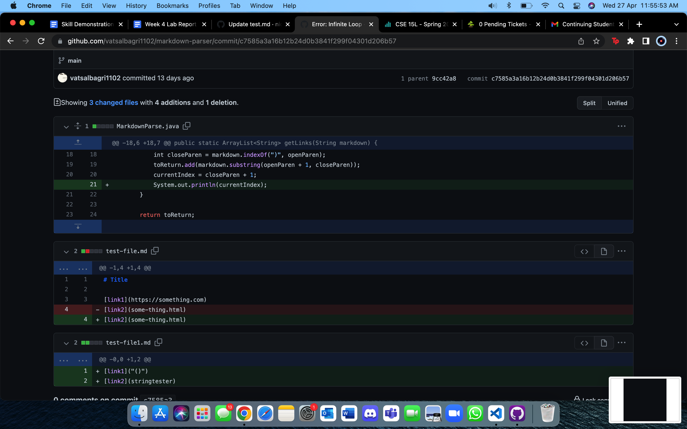

# Lab Report 2 - Week 4

## Code change diff

Through all of the development, the commit history of my repository looks something like

## Failure inducing output

During the past 2 weeks we focused on the ideas of incremental programming and debugging. The lab activities required us to fork a repository and write our own version of the Markdown parse. 

When I wrote my own test file which looked something like [this](https://github.com/vatsalbagri1102/markdown-parser/blob/main/test-file1.md)

## Symptom of the failure inducing output

The terminal shows the infinite loop which is caused by the output as shown in the previous section. The numbers repeat infinitely in the terminal suggesting an error in the code. 

## Relationship

There is a relationship between the bug, failure inducing output and the symptom. The bug is simply that the code doesn't account for the extra line. It keeps searching for the parenthesis and the empty line doesn't provide an ending point for the loop causing the previous data to run repeatedly resulting in the repeating numbers of the terminal 