# Lab Report 3 - Week 6

## Streamlining ssh Config

The streamlining of the ssh config helps in increasing the efficiency of logging into the remote server i.e., ieng6. By using the code given to us and adding that to the ssh folder in the local machine, I ensured that by just typing ssh ieng6, I will be able to log back into the server. The following image shows the process of adding the code and logging in:

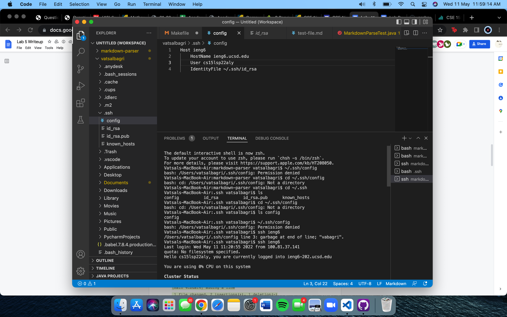

Furthermore, rather than typing the entire address in the long form, I can use the ieng6 alias to scp files into the server too. I have done so in the screenshot below where I scp'd test-file.md and then ls'd that to show that the file exists in the server now.

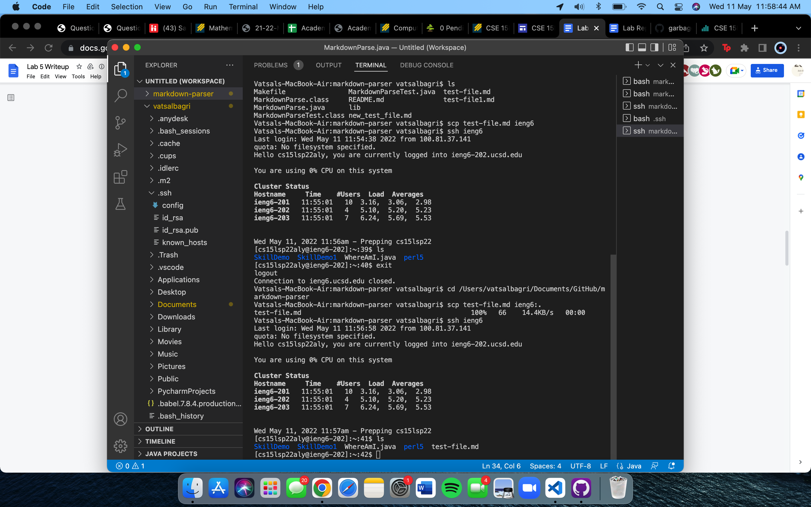

## Setup GitHub access from ieng6

The first thing that I did for this is to create a ssh key for the remote server as it did not exist before. After following the tutorials, I copied this key and added it to the remote server. The process of creating this key and its private and public versions can be seen in the screenshots below:

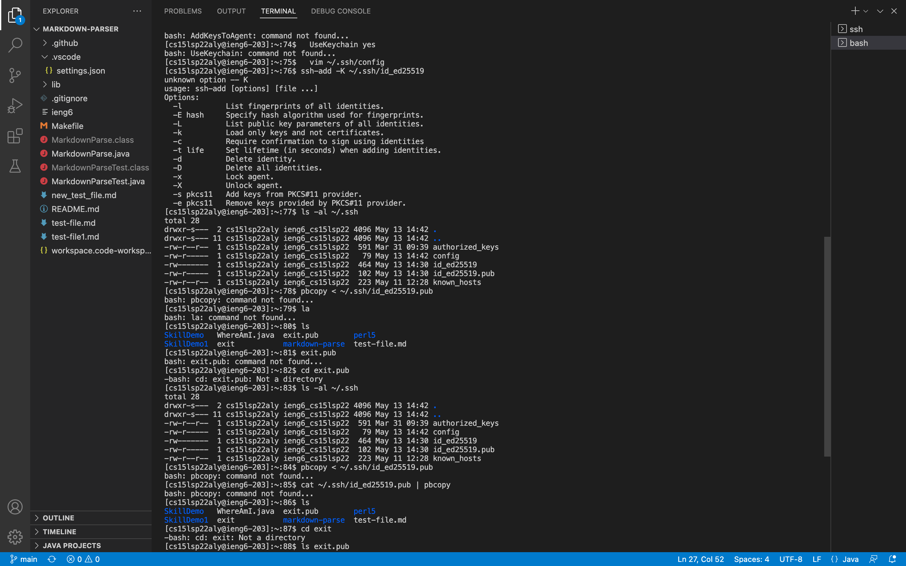
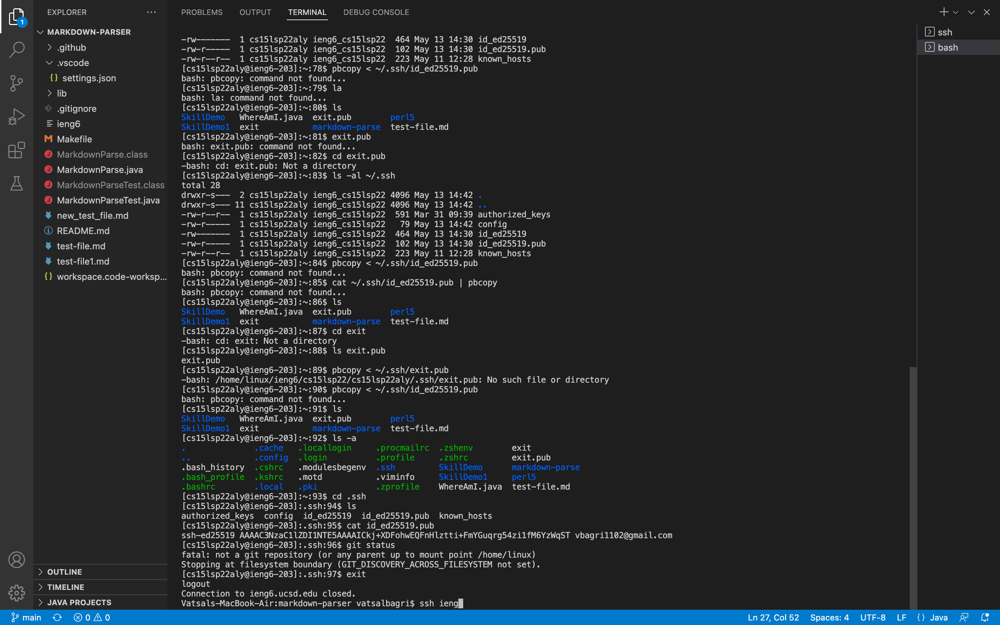
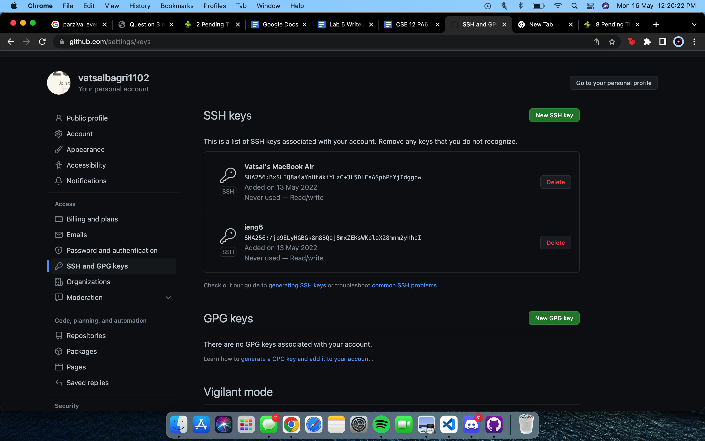

The last screenshot shows the key on my github account, the one before that shows that it exists in my user account too.

Lastly, after creating a small change in the file, I used my user account github access to commit and push the change which can be seen in the following screenshots:

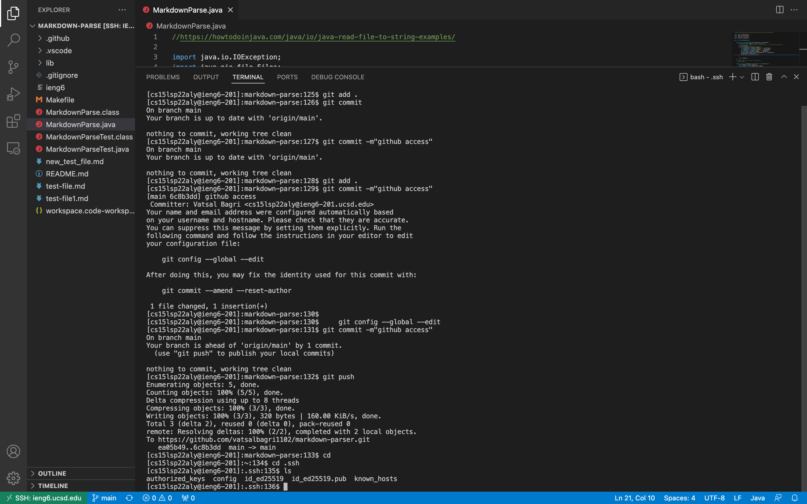
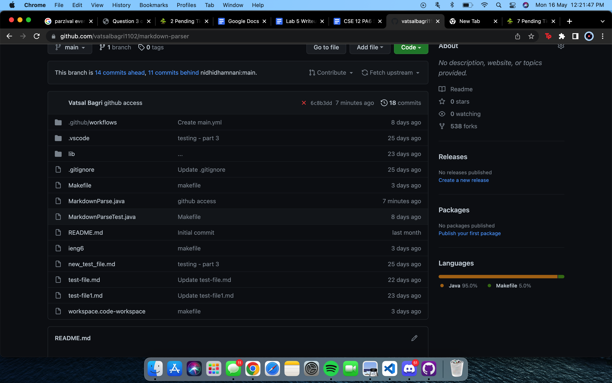

## Copy entire directories with scp -r

To scp an entire directory rather scp'ing individual file, using scp -r, one can recursively scp all the files into the server as I have done below. Moreover, I have used the alias that I created earlier too. This can be seen in the images below where the first one shows the command being run and the second one showing the entire directory being visible in the server:

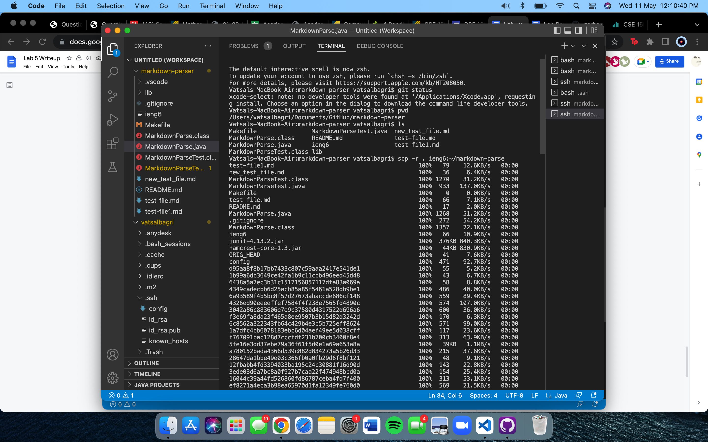
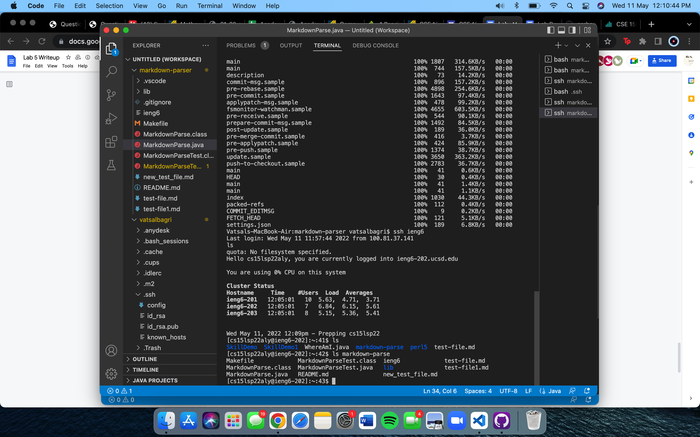

To ensure that the files actually existed, I logged into the server, compiled and ran the files (expecting an error): 

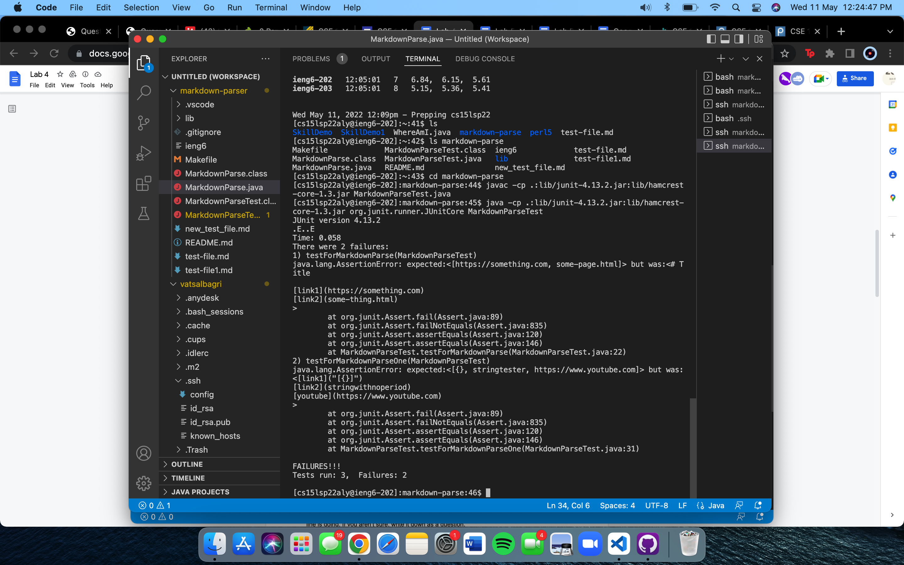

Lastly, to add to the efficiency of the whole process, I combined the commands of scp, ssh, compile and the running the files using the ';'.

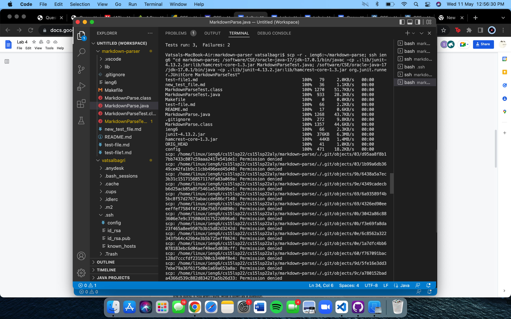
