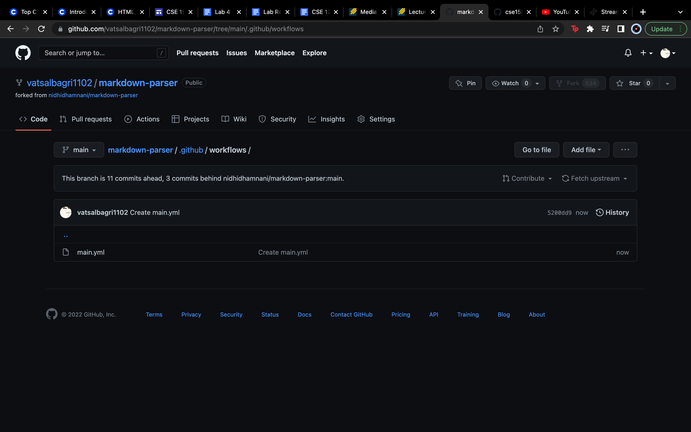
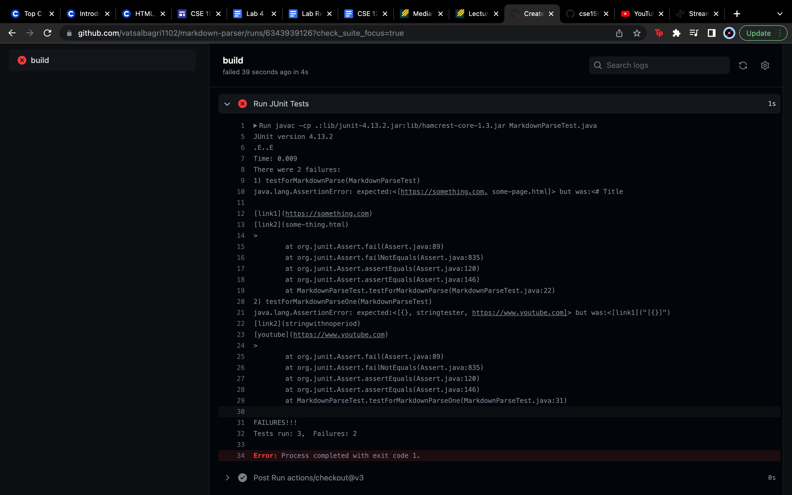
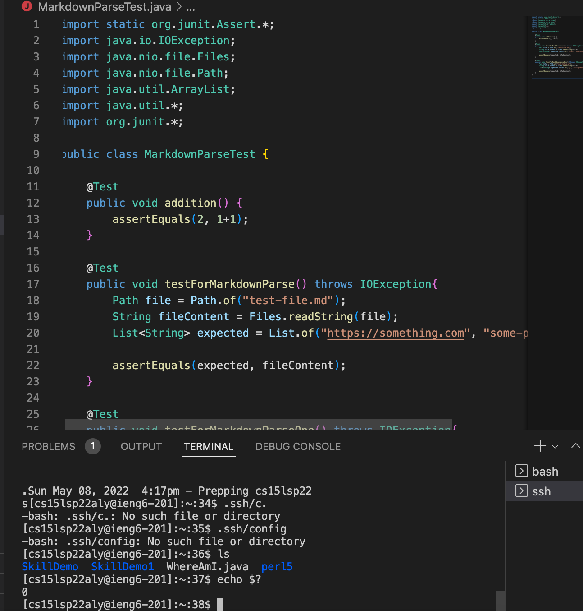

# Lab Report 3 - Week 6

## Streamlining ssh Config

created the config file and then logged in using the alias

scp's a testfile into the home directory using the alias

## Setting up GitHub Actions

I set up GitHub Actions in using the .yml file in the actions tab on my MarkDown repository. After that, I setup the multiline commands to compile and run the file as it can be seen in the image below:

The tests that were run failed as I ran the test files with the error inducing input and that can be seen in the image below:

Hence I setup GitHub actions. Now, to run it through my ieng6 account, I ssh'd into the server, wrote ls and then ran echo$? to get the output as 0 which is the exit status of the last command. This can be seen in the image below -

