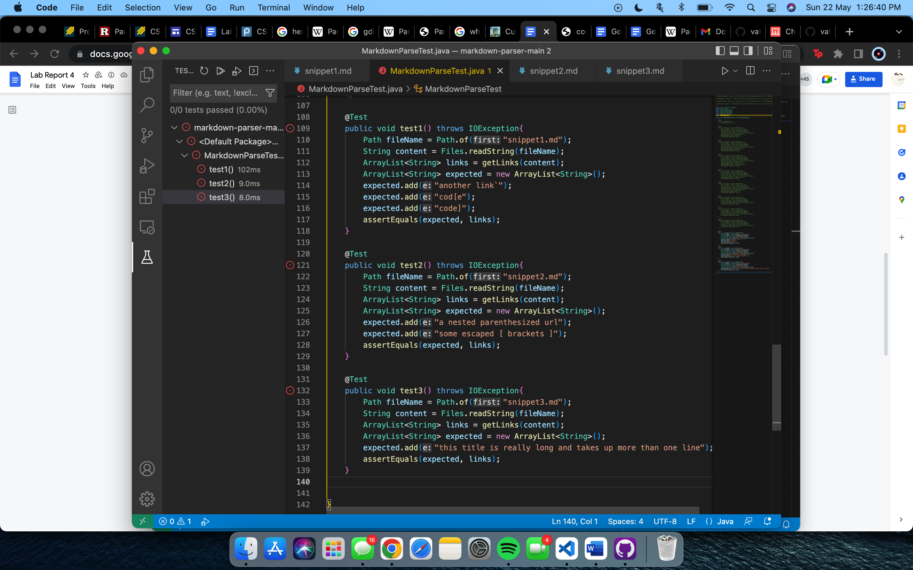
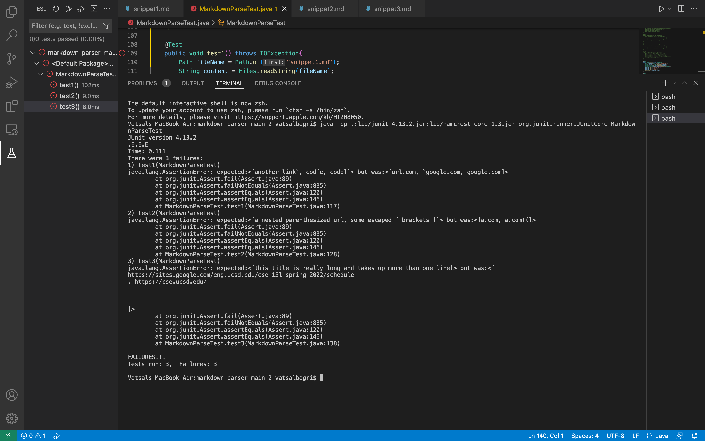
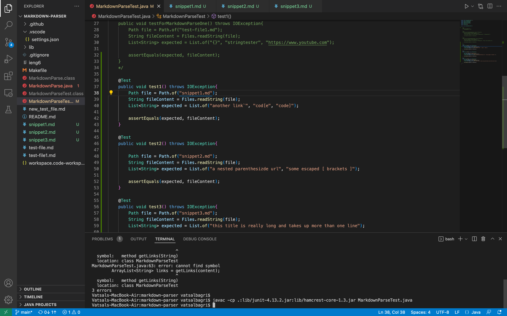
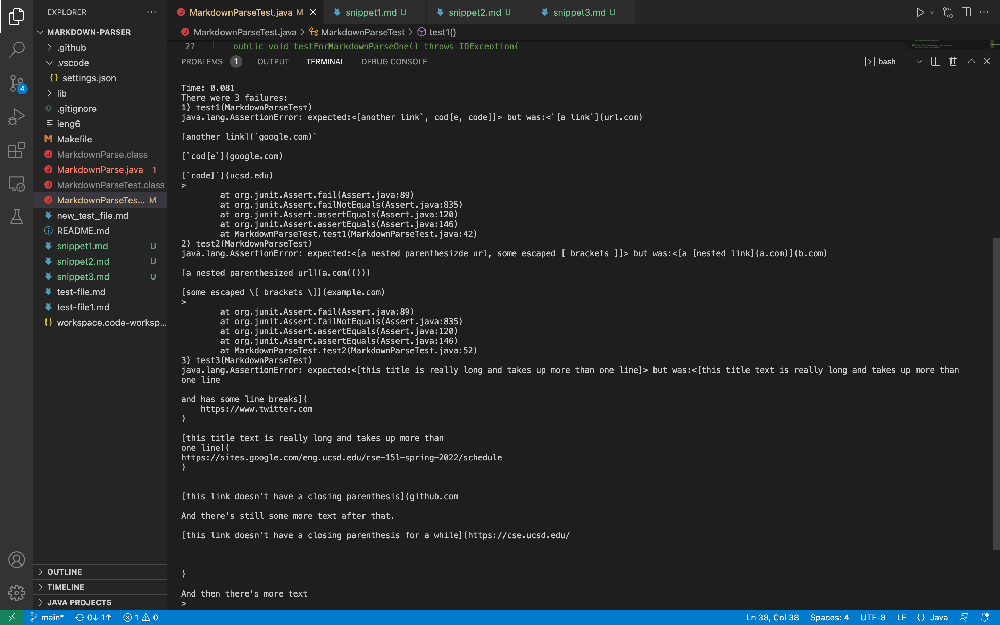

# Lab Report 4 - Week 8

For this lab report, I will be comparing two implementations of MarkdownParse. One of these is my own whereas the other one is we peer reviewed during Lab 7.

The link to both of the repositories is below:

[Peer's work](https://github.com/NLChung9/markdown-parser)

[My work](https://github.com/vatsalbagri1102/markdown-parser)

## Peer's work

Upon writing the tests for each of the snippets and finding its expected output through the CommonMark website, the MarkdownParseTest file looked like the following:

After compiling and running the program, all of the tests fail as shown in the screenshot below:

## My work

The tests for me looked really similar as the files being tested for the same. The screenshot below shows the test file:

The results for my code are similar where every test fails:

## Possible changes

### Snippet 1

I believe that a small change is quite possible as all we have to do is account for the "`" marks the way that we did for the different possible brackets. Accounting for this new mark increase the possibilities of success in the code. 

### Snippet 2

I believe that the solution to this error is similar to that of snippet 1. Accounting for the special character of \ and keeping track of the parenthesis more efficiently can fix the errors.

### Snippet 3

The error in this snippet is the same where the line breaks cause issues in the final output of the code. This trend proves that maybe including a library of special characters as a separate file and then comparing data through that could fix all of the issues arising. 