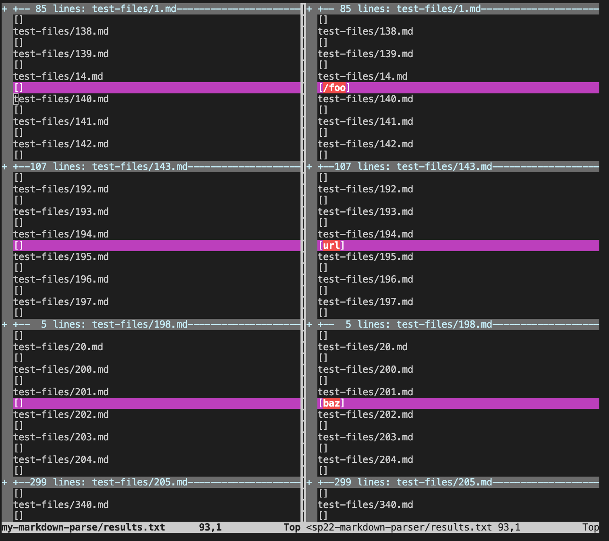
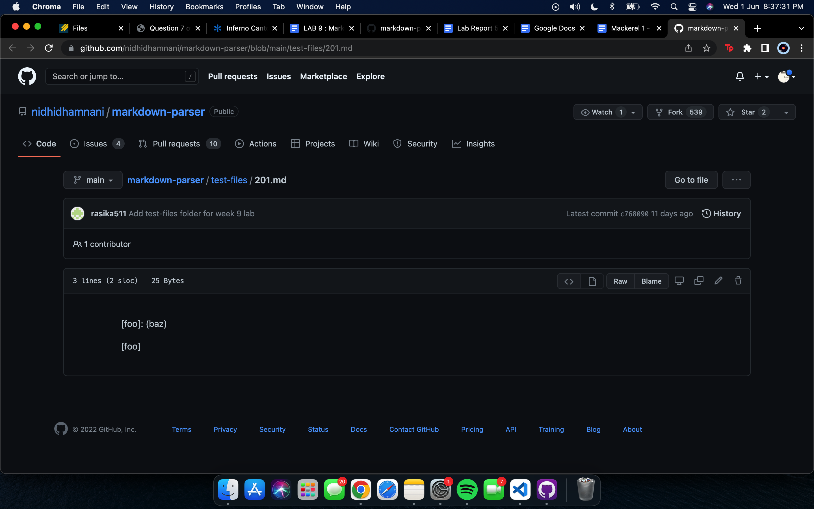

# Lab Report 5 - Week 10

For this lab report I compared two different implementations of markdownParse i.e mine and the one provided in Lab 9. After running the bash files and exporting the results of both to a file results.txt. 

To compare both of these files, I used the vimdiff command with the code

```vimdiff my-markdown-parse/results.txt cse15lsp22-markdown-parser/results.txt```

The result of that command looks like the following:



From the result above, I pick the following two test files:
[194](https://github.com/nidhidhamnani/markdown-parser/blob/main/test-files/193.md) and [201](https://github.com/nidhidhamnani/markdown-parser/blob/main/test-files/201.md).

For test file 194, both of the implementations return the wrong output. According the GitHub and markdown, the output should be a link "foo" which is shown in the image below  

The actual output for my own implementation was an empty array and the given implementation was showed an array with "/foo" in it. 

For test file 201, both of the implementations return the wrong output too. According the GitHub and markdown, the output should be:

"[foo]: (baz)"

"[foo]"

which is shown in the image below 

The GitHub screenshots above are of the final output after trying on the VS Code. Moreover, the output has been tried on the CommonMark site too and it is the same. 

The wrong output for each one of the implementations suggests that there is a bug in the implementation, the bug for each one can be described as the following:

The issue for both of the implementations is really similar. Both of them are not able to take into consideration the special characters which exist. The only difference is that the given implementation is able to consider more special characters unlike my own. That is the only reason that it is able to actually add something to the array. The debug for both of these errors is really similar. Although I cannot point out the specific line, the debug involves considering a wider range of characters including spaces, colons etc. to ensure that all inputs lead to the right result.   